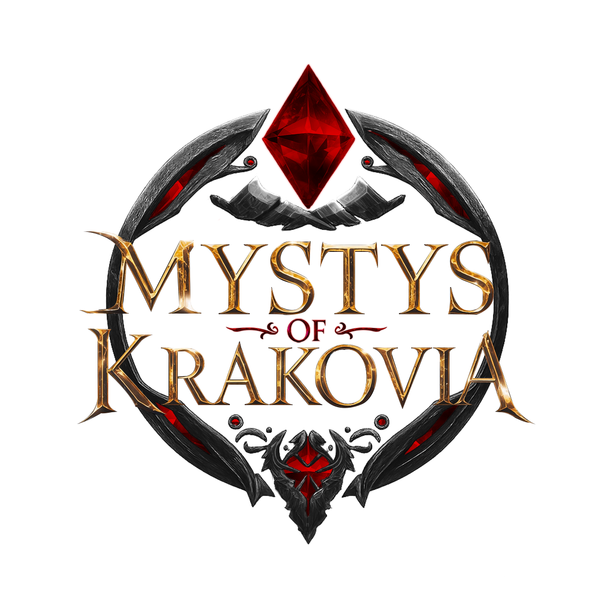

  

A modern and interactive landing page with a video background, built with the latest technologies in the React ecosystem. The project features a persistent layout with dynamic content, including a registration form with real-time asynchronous validation.

---

## Tech Stack
This project was built using the following technologies:

**Core Framework**: React.js
**Language**: TypeScript
**Build Tool**: Vite
**Styling**: Tailwind CSS
**UI Components**: Shadcn/UI
**Routing**: React Router DOM
**Form Management**: React Hook Form
**Schema Validation**: Zod
**Icons**: Lucide React

---